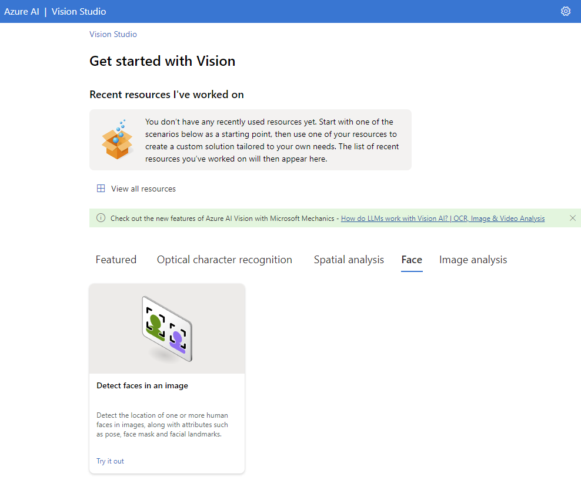
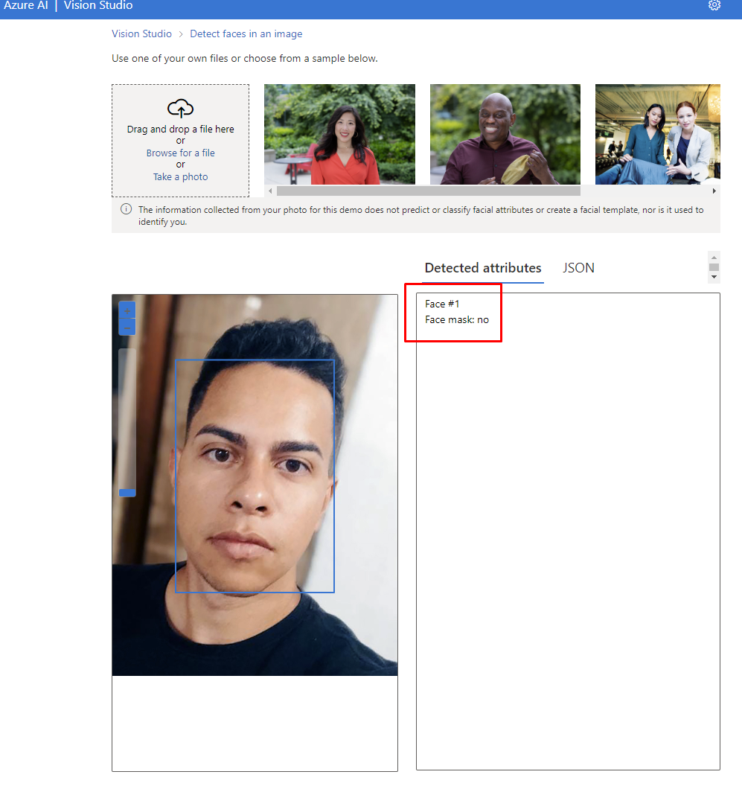
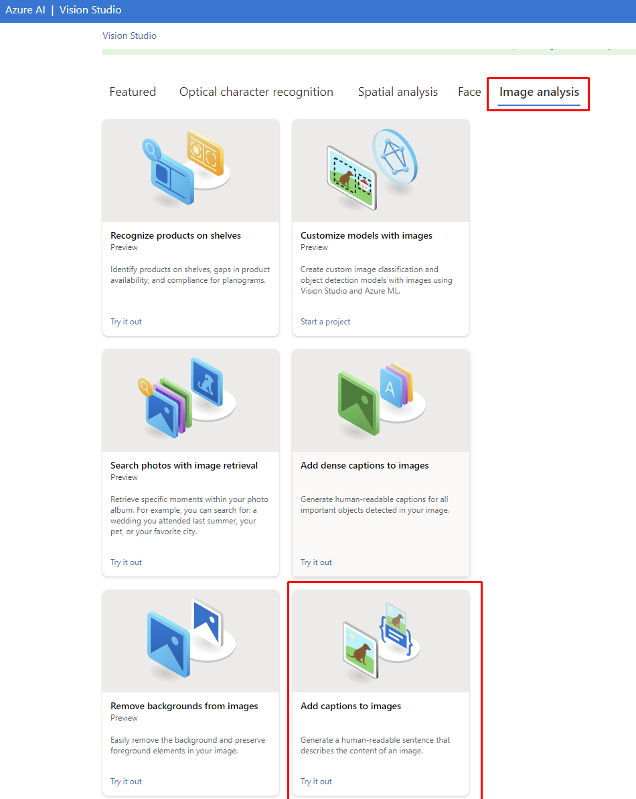
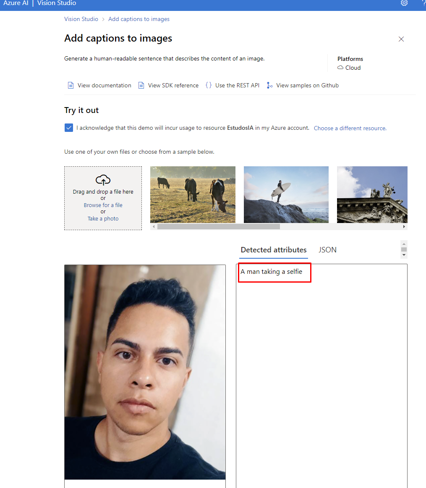
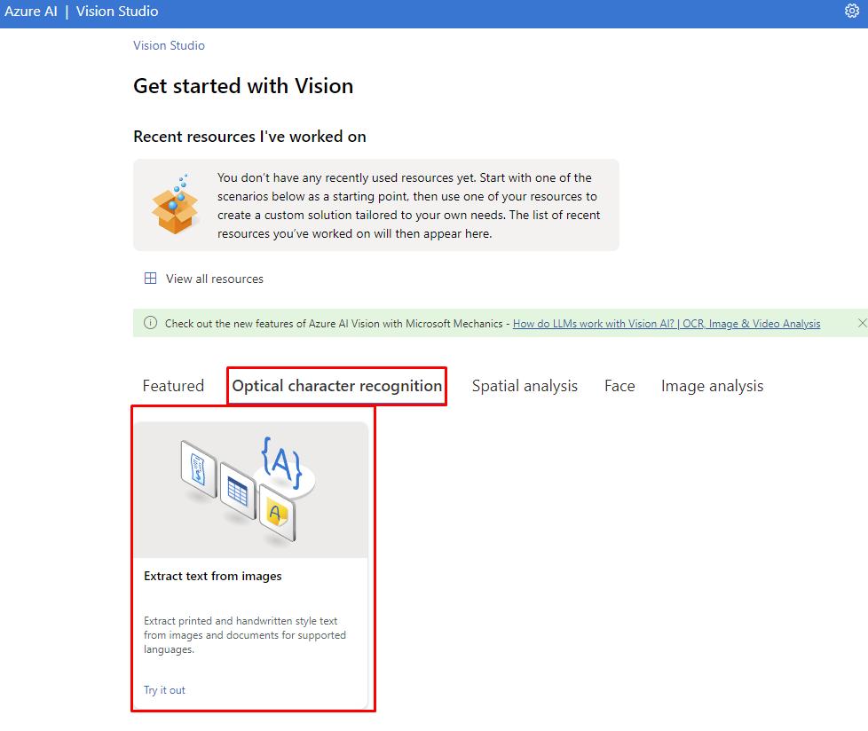
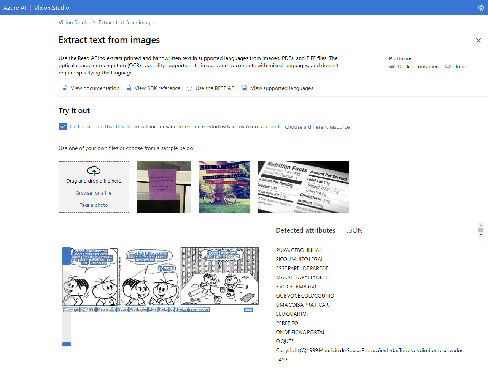

# Reconhecimento facil e transformação em Dados

## Reconhecimento de faces  

Através deste recurso, podemos utilizar uma imagem e reconhecer quantas faces estão presentes

* Dentro do Vision Studio, na guia Face, selecionamos a opção **Detect faces in a image**

* Em seguida, podemos utilizar uma das imagens de exemplo do próprio portal, ou realizar upload da imagem de nossa preferência, neste caso, fiz upload de uma imagem

* Automaticamente o recurso nos exibe quantas faces foram reconhecidas  

# Adicionar legendas em imagens

Através deste recurso, a Inteligência Artificial fará uma análise da imagem e escolhida e descrever o que ela identificou

* Dentro do Vision Studio, na guia Image Analysis, selecionamos Add captions to images

* Em seguida, escolhemos uma das imagens de exemplo, ou podemos fazer upload

* Automaticamente temos o resultado da análise  

# Reconhecimento óptico de caracteres

Através deste recurso, a Inteligência Artificial reconhece e extrai textos das imagens, muito útil para digitalização de documentos e notas

* Dentro do Vision Studio, na guia Optical character recognition, selecionamos Extract text from images

* Assim como nos outros recursos, podemos escolher uma imagem de exemplo ou fazer upload

* Automaticamente, temos o texto reconhecido apresentado ao lado da imagem  

# Considerações finais

Podemos utilizar os recursos de Inteligência Artificial para inúmeras soluções do dia a dia, facilitando assim a manutenção de arquivos, economia de espaço e tempo de trabalho para obter dados